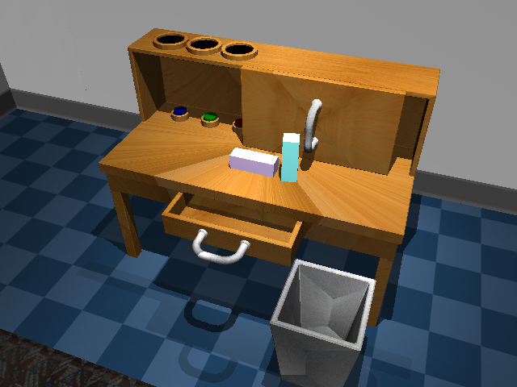

# Franka Desk environment for RL

This repo contains the Play environment from [this paper](https://learning-from-play.github.io/), combined with a Franka robot. The code in this repo was written in part by 
the authors of learning-from-play.github.io, Stephen Tian, Suraj Nair, and other developers, and in no part by me. 

